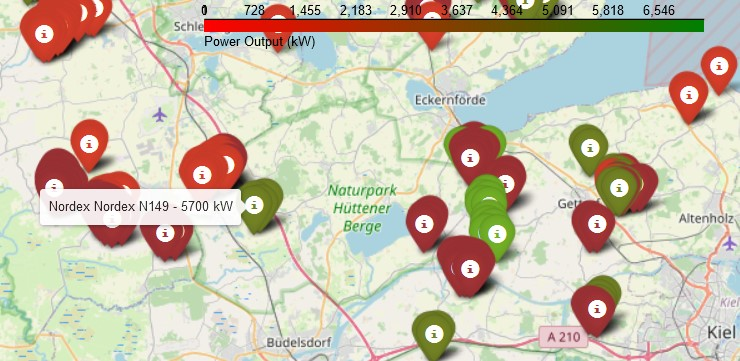

# Windmill Power Landscape

## A Geospatial Analysis and Visualization of Renewable Energy Assets

### Overview
This project offers a comprehensive analysis and visualization of windmill data to uncover insights into renewable energy distribution. Utilizing Python's powerful libraries, we process geographical information to plot the locations of windmills and analyze their characteristics, such as type and manufacturer distribution, across different regions.

### Quickstart
1. Clone the repository.
2. Install dependencies: `pip install pandas folium pyproj matplotlib seaborn`
3. Run the Jupyter notebooks to explore the datasets and visualizations.

### Features
- Interactive maps with `folium`
- Statistical analysis of windmill types and manufacturers with `pandas`
- Geospatial data transformation with `pyproj`
- Visualizations with `matplotlib` and `seaborn`

Dive into the data to explore the future of energy through the lens of wind power!
